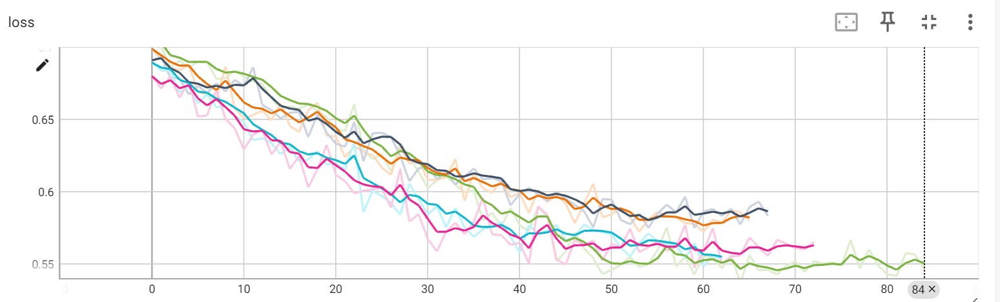
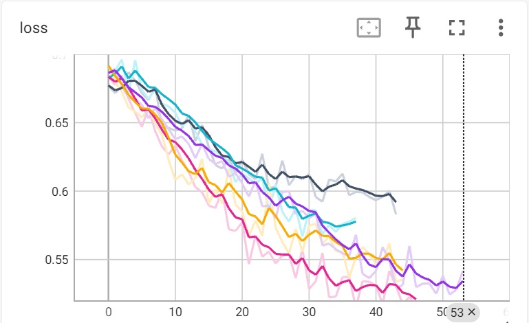
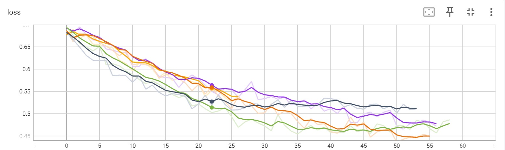
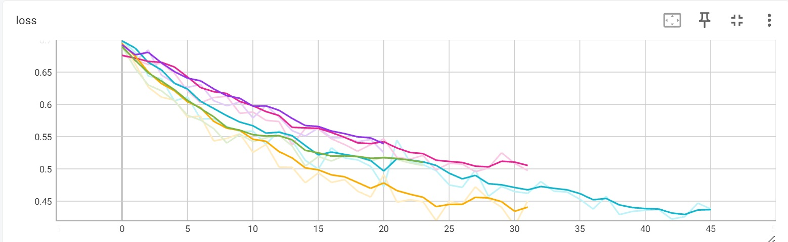

# Отчет 1. Исследование метода кросс-энтропии в среде Cartpole 

## 1. Число скрытых нейронов (2 балла)
При начальном значении `hidden_state=32` сходимость достигается в среднем за 70 итераций (Интервалы от 62 до 84). График функции потерь приведен ниже. 



При увеличении значения `hidden_state=64` сходимость достигается в среднем за 44 итераций (Интервалы от 37 до 53). Здесь на графике есть существенные отличия между 32-мя скрытыми нейронами и 64. Увеличение числа скрытых нейронов влияет на скорость сходимости агента в меньшую сторону. Графики функции потерь и среднего вознаграждения приведены ниже. 



Третье значение `hidden_state=128` сходимость достигается в среднем за 49 итераций (Интервалы от 26 до 58). В данном случае,  увелечение никак не повлияло на скорость сходимости агента.  
Графики функции потерь и среднего вознаграждения приведены ниже. 



Четвертое значение `hidden_state=256` демонстрирует кардинальные отличия от предыдущих показателей. Сходимость достигается в среднем за 30 итераций - в 1,5 раза меньше чем при 64. Интервалы от 20 до 45.



## 2. Архитектура нейросети (3 балла)

Испольлзовалась следующая архитектура нейронной сети:

```
nn.Linear(obs_size, hidden_size),
nn.ReLU(),
nn.Linear(hidden_size, n_actions)
nn.ReLU()
nn.Linear(hidden_size, n_actions)
```
Значение `hidden_size=64`. 
Для этой архитектуры сходимость достигается в среднем за 53 итерации. Данный показатель сходимости является ниже, нежели, чем при одном скрытым слое.Можно сделать вывод, что увеличение числа скрытых нейронов не влияет на скорость сходимости агента. Графики функции потерь и среднего вознаграждения приведены ниже. 


## 3. Видео отчет (2 балла)
Лучший результат показала архитектура, которая имеет следующий вид: 
```
nn.Linear(obs_size, hidden_size),
nn.ReLU(),
nn.Linear(hidden_size, n_actions)
```
Значение `hidden_size=64`. 
Для этой архитектуры сходимость достигается в среднем за 53 итераций. 
Видео с примером работы агента приведено ниже.  

<video src="video\rl-video-episode-0.mp4" width="240"/>
